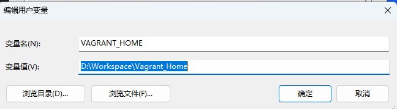
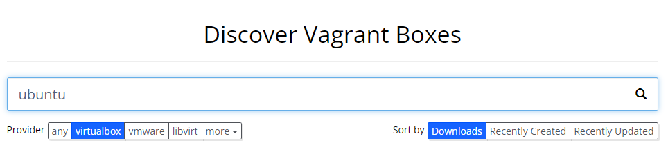
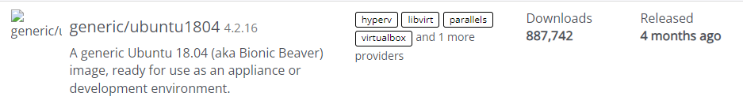
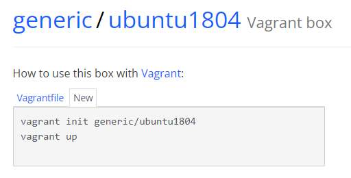
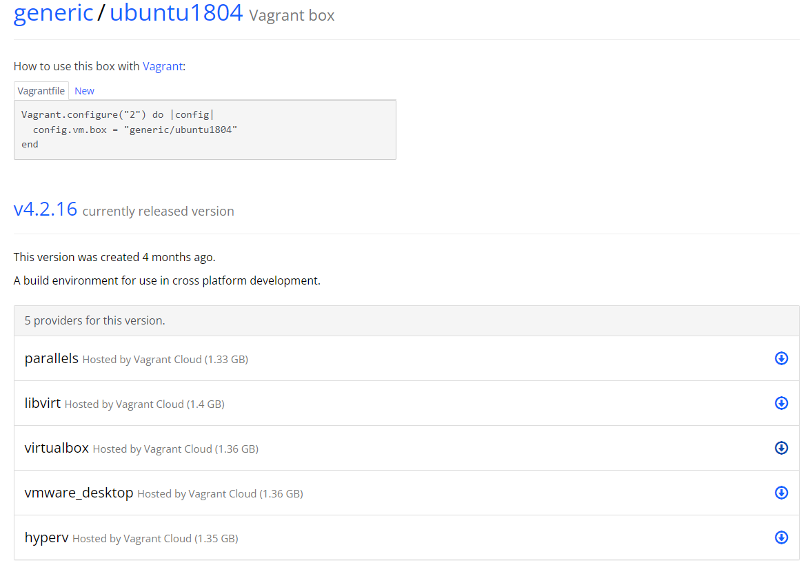

# the_vagrant_lab
Vagrant简明步骤

本文仅简单介绍在 Windows 中如何使用 Vagrant + Virtualbox 启动虚拟机，搭建实验环境。

如需更详细资料，请查阅官方文档 https://developer.hashicorp.com/tutorials/library?product=vagrant

提前安装好 virtualbox 虚拟机软件， 下载链接 https://www.virtualbox.org/wiki/Downloads

从官网下载vagrant并安装

https://developer.hashicorp.com/vagrant/downloads?product_intent=vagrant

各选项保持默认即可，安装完成后将 vagrant.exe 文件夹路径加入 Path 环境变量

<br>

如果系统盘空间不足 则可添加 VAGRANT_HOME 环境变量，将Vagrantbox文件存储到其他盘 例如 D:\Workspace\Vagrant_Home


<br>

安装完成后在命令行窗口运行 `vagrant -v` 如果能显示版本号 则说明安装成功

确认安装成功之后 即可使用 vagrant 下载启动虚拟机镜像

先搜要用的虚拟机镜像 https://app.vagrantup.com/boxes/search 

以 Ubuntu 为例，搜索ubuntu



<br>

点击 Provider 中的 virtualbox 选项卡

选择任意一个镜像 例如 generic/ubuntu1804



<br>

点击进入该镜像页面 

此处有两种办法可以启动虚拟机

一是使用命令让 Vagrant 自动下载镜像并启动

二是先手动下载镜像再启动，此方法适合网络不好 或者无法自动下载的情况下使用

<br>

### 先看自动下载

点击 New 



<br>

提前创建好工作目录，并在命令行窗口切换到此目录，

然后复制 New 里面的命令，从命令行窗口执行

例如

```
D:
cd D:\Workspace\Vagrant_Home\VM\Ubuntu
vagrant init generic/ubuntu1804
vagrant up
```

`vagrant init` 会创建 vagrantfile， 其中包含一些默认配置 

`vagrant up` 会 Vagrantfile 的配置在虚拟机中自动创建一个虚拟机并启动

注意: 虚拟机会创建在 virtualbox 的默认工作目录中，可以在virtualbox中将默认目录设置到其他盘，避免系统盘空间不足。

启动完成之后 使用 `vagrant ssh` 命令连接到启动好的虚拟机

运行`whoami` 查看登录账号

运行 `sudo su -` 切换到 root 账号

根据自己的需求 添加新账号，修改root账号密码，设置可以用密码登录，添加 ssh key

用完之后 可以在 ubuntu 里面直接关机

或者退出ssh 连接之后 使用 `vagrant halt` 命令关机

如果不在需要这台虚拟机 则可以用 `vagrant destroy` 删除虚拟机

或者从 virtualbox里面直接删除

<br>

### 接下来介绍手动下载镜像并启动

回到 vagrant box 页面



<br>

选择想要的版本 例如 v4.2.16, 点击 virtualbox 后面的下载按钮

将文件下载到 vagrant_home 目录中， 也可以存放在其他任意目录

执行以下命令 将下载好的镜像文件 添加到vagrant box中 并启动

```
vagrant box add "D:\Workspace\Vagrant_Home\vagrantboxUbuntu\60571a47-2ae9-4347-bd1e-4a08f195ef16" --name vagrantubuntu
vagrant box list
vagrant init vagrantubuntu
vagrant up
```
`vagrant box add` 将会添加本地 vagrant box， 

其中 `D:\Workspace\Vagrant_Home\vagrantboxUbuntu\` 是存放镜像文件的路径， `60571a47-2ae9-4347-bd1e-4a08f195ef16` 是下载的镜像文件文件名

注意将这两个值修改成自己机器上对应的路径和文件名

`vagrantubuntu` 是本地创建的 vagrant box 名称，可以根据需要修改成任意值

`vagrant box list` 将会列出机器上的 vagrant box

`vagrant init vagrantubuntu` 和 `vagrant up` 与之前介绍自动下载的过程中的作用相同

接下来操作和自动下载的操作相同。


### 最后再简单介绍一下 vagrantfile 的设置

`vagrant init vagrantubuntu` 命令运行之后会自动创建一个 vagrantfile 文件

下列示例更改了一些虚拟机设置， 可根据自己的需求修改完 vagrantfile 之后再用 `vagrant up` 启动虚拟机

```
Vagrant.configure("2") do |config|

  config.vm.box = "vagrantubuntu"
  
  #虚拟机主机名称
  config.vm.hostname = "master"
  
  #磁盘大小
  config.disksize.size = "40GB"
  
  # 配置成静态IP地址
  # 对于 virtualbox 虚拟机 系统默认会启用NAT网络
  # 此处设置的是 host-only 网络 ip 地址
  config.vm.network "private_network", ip: "192.168.56.221"
  

  config.vm.provider "virtualbox" do |vb|    
    vb.gui = false      # 启动机器时显示 VirtualBox GUI    
    vb.memory = "2048"  # 虚拟机存储大小，mb    
    vb.cpus = 2         # cpu 大小
  end

end
```

以下是命令执行时候的显示信息
```
PS D:\Workspace\VM\ubuntu> vagrant up
Bringing machine 'default' up with 'virtualbox' provider...
==> default: Importing base box 'vagrantubuntu'...
==> default: Matching MAC address for NAT networking...
==> default: Setting the name of the VM: ubuntu_default_1691165342116_643
==> default: Clearing any previously set network interfaces...
==> default: Preparing network interfaces based on configuration...
    default: Adapter 1: nat
    default: Adapter 2: hostonly
==> default: Forwarding ports...
    default: 22 (guest) => 2222 (host) (adapter 1)
==> default: Running 'pre-boot' VM customizations...
==> default: Booting VM...
==> default: Waiting for machine to boot. This may take a few minutes...
    default: SSH address: 127.0.0.1:2222
    default: SSH username: vagrant
    default: SSH auth method: private key
    default:
    default: Vagrant insecure key detected. Vagrant will automatically replace
    default: this with a newly generated keypair for better security.
    default:
    default: Inserting generated public key within guest...
    default: Removing insecure key from the guest if it's present...
    default: Key inserted! Disconnecting and reconnecting using new SSH key...
==> default: Machine booted and ready!
==> default: Checking for guest additions in VM...
    default: The guest additions on this VM do not match the installed version of
    default: VirtualBox! In most cases this is fine, but in rare cases it can
    default: prevent things such as shared folders from working properly. If you see
    default: shared folder errors, please make sure the guest additions within the
    default: virtual machine match the version of VirtualBox you have installed on
    default: your host and reload your VM.
    default:
    default: Guest Additions Version: 5.2.42
    default: VirtualBox Version: 6.1
==> default: Configuring and enabling network interfaces...
```
此时显示启动成功 注意其中的 SSH 相关信息


以下是连接到虚拟机并且允许root用户用密码登录
```
PS D:\Workspace\VM\ubuntu> vagrant ssh
vagrant@ubuntu1804:~$ whoami
vagrant
vagrant@ubuntu1804:~$ sudo su -
root@ubuntu1804:~# passwd
Enter new UNIX password:
Retype new UNIX password:
passwd: password updated successfully
root@ubuntu1804:~# vi /etc/ssh/sshd_config
    
    # 如果需要允许root密码登录 则作如下修改
    PermitRootLogin yes
    PasswordAuthentication yes
    # 保存退出
    
# 重启sshd
root@ubuntu1804:~# systemctl restart sshd
```

开个新窗口用 host-only 的 ip 地址登录

如果没有设置 host-only 网络 则用可 `127.0.0.1:2222` 登录

`127.0.0.1:2222` 是 `vagrant up` 自动创建的 端口映射,可以从上面的记录查看到， 或者通过 virtualbox NAT网络的端口映射中查到

```
ssh root@192.168.56.221
The authenticity of host '192.168.56.221 (192.168.56.221)' can't be established.
ED25519 key fingerprint is SHA256:udihzeDV9JKVqh0OrB1LOt+27FmX+5euEpmllYENkCc.
This key is not known by any other names
Are you sure you want to continue connecting (yes/no/[fingerprint])? yes
Warning: Permanently added '192.168.56.221' (ED25519) to the list of known hosts.
root@192.168.56.221's password:
root@ubuntu1804:~#
```

以上就是最基础的 用 vagrant + virtualbox 创建虚拟机的方法

####本文结束####